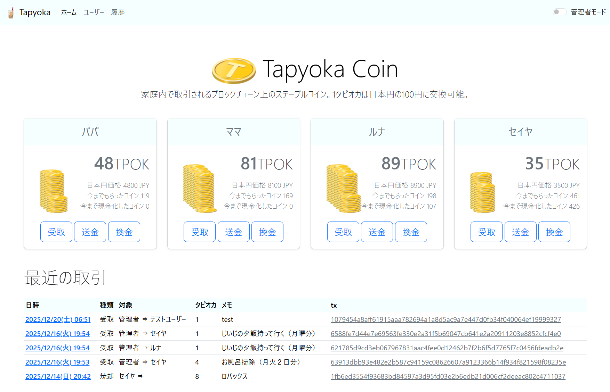

# Tapyoka Coin
家族内で使えるブロックチェーンを用いたお小遣いアプリ

<a href="tapyoka.png"></a>


## 概要

Tapyoka Coinは、家族内で使えるブロックチェーンを用いたお小遣いアプリです。お金を直接渡す代わりに、仮想通貨「タピオカコイン」として価値を記録します。「面倒なことを自動化して、家族の関係をすこしだけスムーズにする」 ことを目的としています。

このシステムは [Tapyrus API](https://site.tapyrus.chaintope.com/api/) と連携してブロックチェーン上のトークンを管理します。管理者は ActiveAdmin を通じてユーザーやトランザクションを管理でき、ユーザーはトークンの送付、バーン、ギフトなどの操作を行うことができます。

## 主な機能

- **ユーザー管理**: ユーザーの登録・編集・削除、ロール管理（一般ユーザー/管理者）
- **トークン操作**:
  - トークンの発行
  - ユーザー間でのトークン送付
  - トークンのバーン（焼却）
  - トークンのギフト配布
- **ウォレット管理**: Tapyrus ブロックチェーン上のアドレス管理
- **タイムスタンプ**: データのハッシュ値をブロックチェーンに記録して証明
- **管理画面**: ActiveAdmin による管理者向けの管理インターフェース
- **トランザクション履歴**: 全てのトークン操作の履歴表示


## セットアップ


### 1. 環境変数の設定

以下の環境変数を設定してください（`.env` ファイルまたはシステム環境変数）:

```bash
# Tapyrus API 接続情報
ACCESS_TOKEN=your_access_token
TAPYRUS_API_ENDPOINT_URL=https://your-tapyrus-api-endpoint.com
PKCS_12_PASS=your_pkcs12_password
TOKEN_ID=your_token_id
```

### 2. クライアント証明書の配置

Tapyrus API クライアント証明書（PKCS#12形式）をプロジェクトルートに配置してください:

```
tapyrus_api_client_cert.p12
```

### 3. データベースのセットアップ

```bash
docker compose exec web rails db:create
docker compose exec web rails db:migrate
docker compose exec web rails db:seed
```

シードデータにより、以下の管理者ユーザーが作成されます:
- **Name**: Admin User
- **Access Token**: admin_access_token_12345
- **Address**: admin_blockchain_address_xyz
- **Amount**: 10000

### 6. アプリケーションにアクセス

ブラウザで http://localhost:3000 にアクセスしてください。


## 主要なコマンド

### Tapyrus API Rake タスク

```bash
# アドレス一覧の取得
rails api:get_addresses[25,1,general]

# アドレスの作成
rails api:post_addresses[general]

# トークン総量の取得
rails api:get_tokens

# トークン情報の取得
rails api:get_token[token_id]

# トークンの新規発行
rails api:post_tokens_issue[amount,token_type,split]

# トークンの送付
rails api:put_tokens_transfer[token_id,address,amount]
```

## モデル

### User

ユーザー情報を管理します。

- `name`: ユーザー名
- `access_token`: Tapyrus API アクセストークン
- `address`: ブロックチェーンアドレス
- `amount`: トークン保有量（DB上の記録）
- `role`: ロール（user: 一般ユーザー、admin: 管理者）

### Transaction

トークンの取引履歴を管理します。

- `user_id`: 送信元ユーザー
- `to_user_id`: 送信先ユーザー（transferの場合）
- `amount`: トークン量
- `transaction_type`: 取引種別（transfer: 送付、burn: バーン、gift: ギフト）
- `disabled`: 無効フラグ

## API 連携

Tapyrus API との連携は `lib/utils/tapyrus_api.rb` で実装されています。以下の機能をサポート:

- トークンの発行・送付・バーン
- ウォレットアドレスの管理
- タイムスタンプの記録・取得
- ユーザー情報の取得

## 管理画面

ActiveAdmin による管理画面にアクセスするには:

```
http://localhost:3000/admin
```

管理画面では以下の操作が可能です:
- ユーザーの管理
- トランザクションの確認
- システム全体の監視

## 開発モード

開発環境では、セッションを使用して管理者モードと一般ユーザーモードを切り替えることができます:

```
/change_admin
```

このエンドポイントにアクセスすることで、管理者表示と一般ユーザー表示を切り替えられます。

## 本番環境

本番環境で運用する場合は、以下の点に注意してください:

1. 環境変数を適切に設定する
2. `config/environments/production.rb` の設定を確認する
3. SSL/TLS 証明書を正しく配置する
4. データベースのバックアップを定期的に実行する
5. ログの監視とローテーションを設定する

systemd サービスとして起動する場合は、`puma.service` ファイルを参照してください。


## トラブルシューティング

### Tapyrus API に接続できない

- `TAPYRUS_API_ENDPOINT_URL` が正しく設定されているか確認
- クライアント証明書 (`tapyrus_api_client_cert.p12`) が配置されているか確認
- `PKCS_12_PASS` が正しいか確認

### トークン操作が失敗する

- `ACCESS_TOKEN` と `TOKEN_ID` が正しく設定されているか確認
- Tapyrus API のステータスを確認
- ログファイル（`log/development.log` または `log/production.log`）を確認

